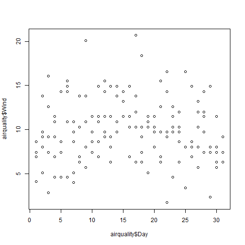

## Application

This is a shiny application to calculate 

- mean,
- median and
- standard deviation 

from longitudinal data.

---

## The data (I)

Wind data from the aiquality data set can be seleted.

  

---

## The data (II)

Temperature data from the aiquality data set can be seleted as well!

 

---

## Start now!

To get started:

Click into the plot:

- go to: https://markist.shinyapps.io/CourseraShinyApp/
- click on the plot
- a line where you clicked will be shown
- the calculated variable will be plotted between the clicks

- P.S: You can choose a title!

